## 1. Total de usuarios por país

```sql
SELECT Pa.nombre, COUNT(U.id) AS total_usuarios
FROM Usuarios U
JOIN Paises Pa ON U.pais_id = Pa.id
GROUP BY Pa.nombre;
```

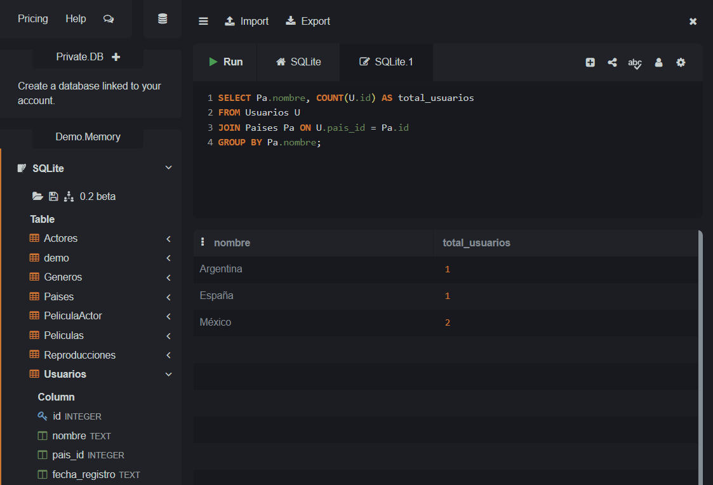

---

## 2. Número de actores registrados por película

```sql
SELECT P.titulo, COUNT(PA.actor_id) AS total_actores
FROM Peliculas P
JOIN PeliculaActor PA ON P.id = PA.pelicula_id
GROUP BY P.titulo;
```

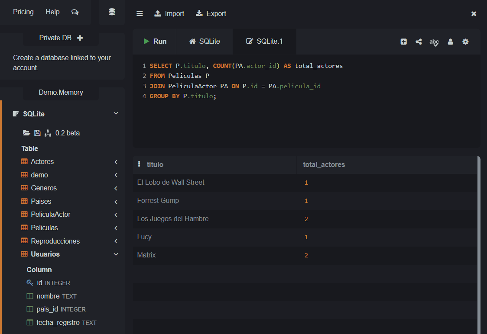

---

## 3. Películas con dos o más actores

```sql
SELECT P.titulo
FROM Peliculas P
JOIN PeliculaActor PA ON P.id = PA.pelicula_id
GROUP BY P.titulo
HAVING COUNT(PA.actor_id) >= 2;
```

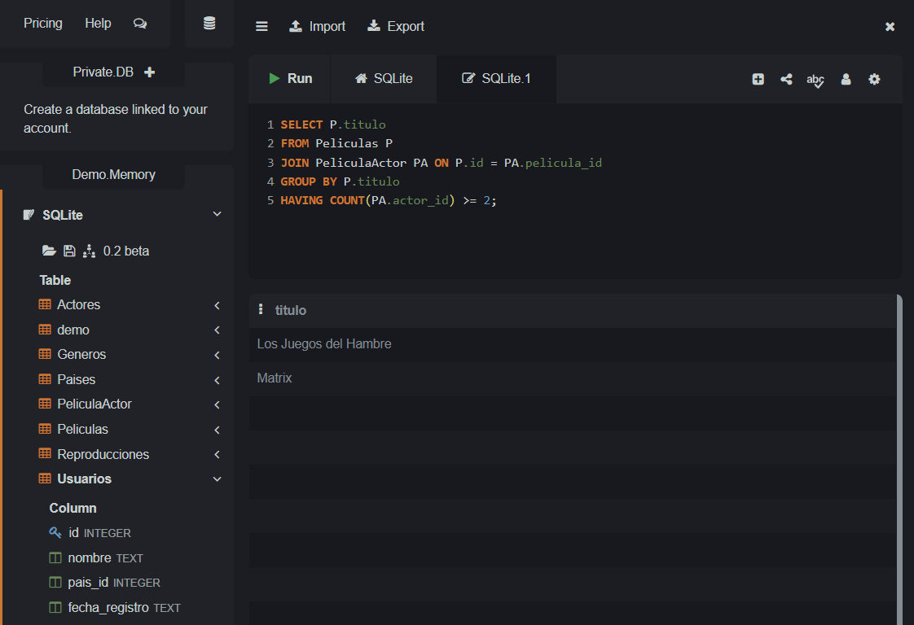

---

## 4. Total de usuarios registrados por año

```sql
SELECT strftime('%Y', fecha_registro) AS anio, COUNT(*) AS total_usuarios
FROM Usuarios
GROUP BY anio;
```

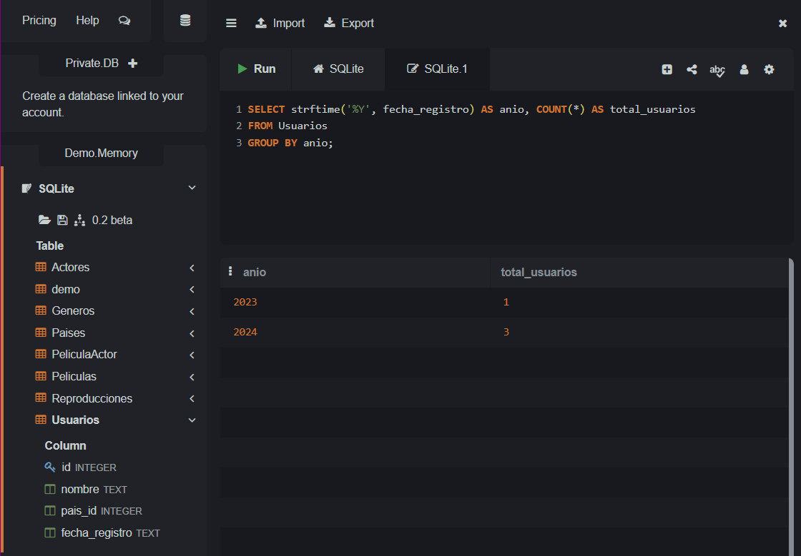

---

## 5. Total de usuarios registrados por país y por año

```sql
SELECT Pa.nombre, strftime('%Y', U.fecha_registro) AS anio, COUNT(*) AS total_usuarios
FROM Usuarios U
JOIN Paises Pa ON U.pais_id = Pa.id
GROUP BY Pa.nombre, anio;
```

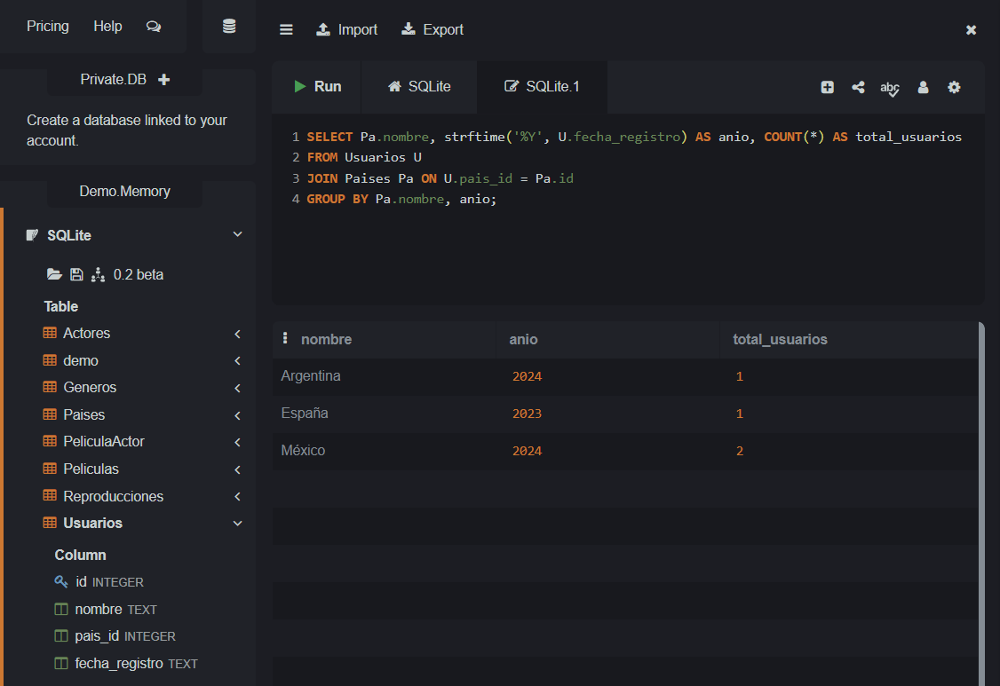

---

## 6. Películas por actor

```sql
SELECT A.nombre AS actor, P.titulo AS pelicula
FROM Actores A
JOIN PeliculaActor PA ON A.id = PA.actor_id
JOIN Peliculas P ON PA.pelicula_id = P.id;
```

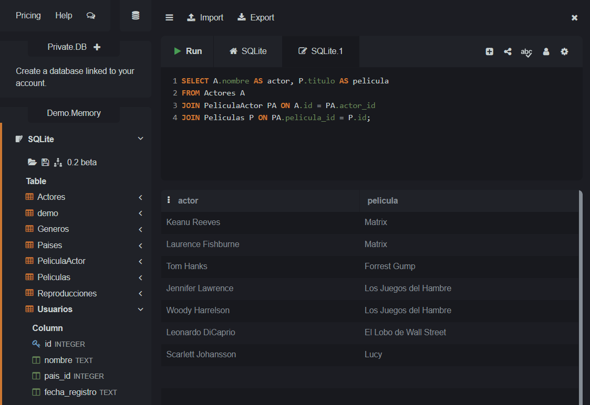

---

## 7. Actores en "Los Juegos del Hambre"

```sql
SELECT A.nombre
FROM Actores A
JOIN PeliculaActor PA ON A.id = PA.actor_id
JOIN Peliculas P ON PA.pelicula_id = P.id
WHERE P.titulo = 'Los Juegos del Hambre';
```

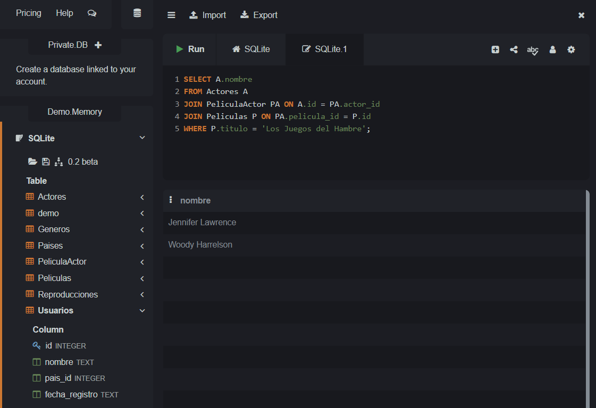

---

## 8. Minutos acumulados por usuario

```sql
SELECT U.nombre, SUM(R.minutos_vistos) AS total_minutos
FROM Usuarios U
JOIN Reproducciones R ON U.id = R.usuario_id
GROUP BY U.nombre;
```

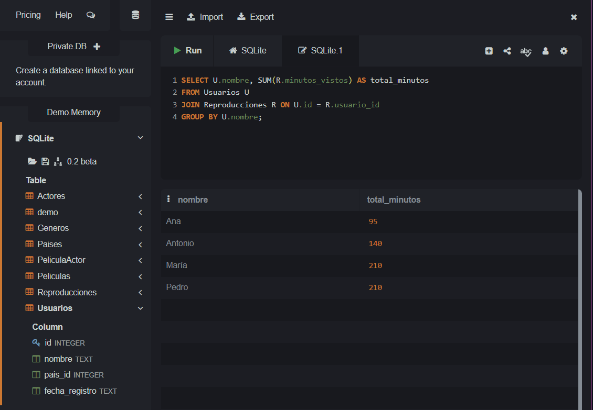

---

## 9. Películas sin reproducciones

```sql
SELECT P.titulo
FROM Peliculas P
LEFT JOIN Reproducciones R ON P.id = R.pelicula_id
WHERE R.pelicula_id IS NULL;
```
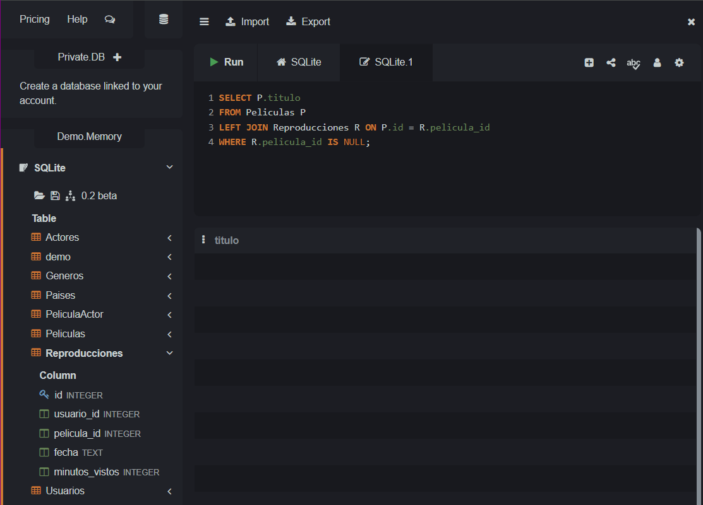
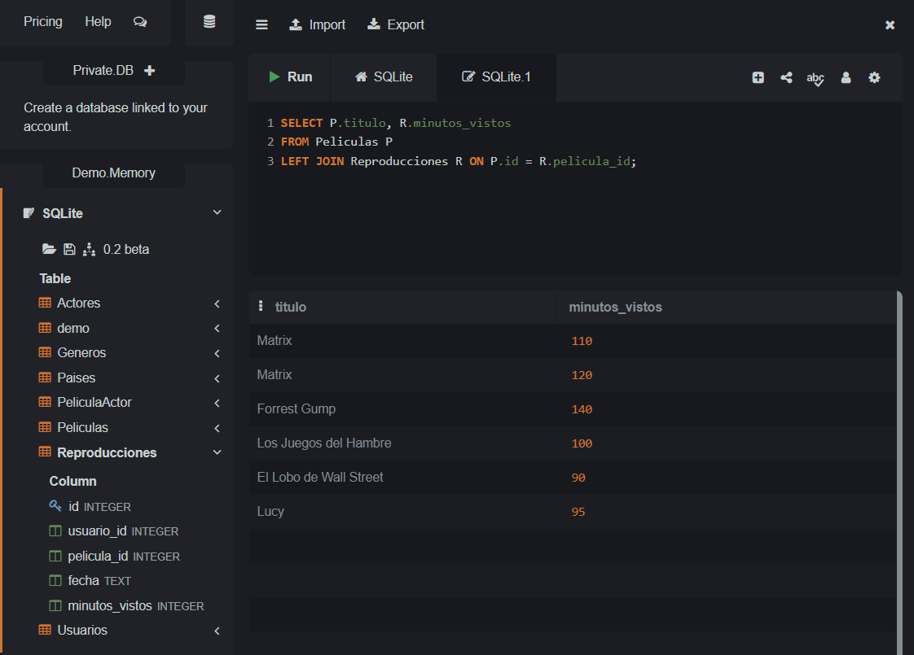

---

## 10. Reto — Actores de películas vistas por usuarios de España

```sql
SELECT DISTINCT A.nombre
FROM Actores A
JOIN PeliculaActor PA ON A.id = PA.actor_id
JOIN Reproducciones R ON PA.pelicula_id = R.pelicula_id
JOIN Usuarios U ON R.usuario_id = U.id
JOIN Paises Pai ON U.pais_id = Pai.id
WHERE Pai.nombre = 'España';
```

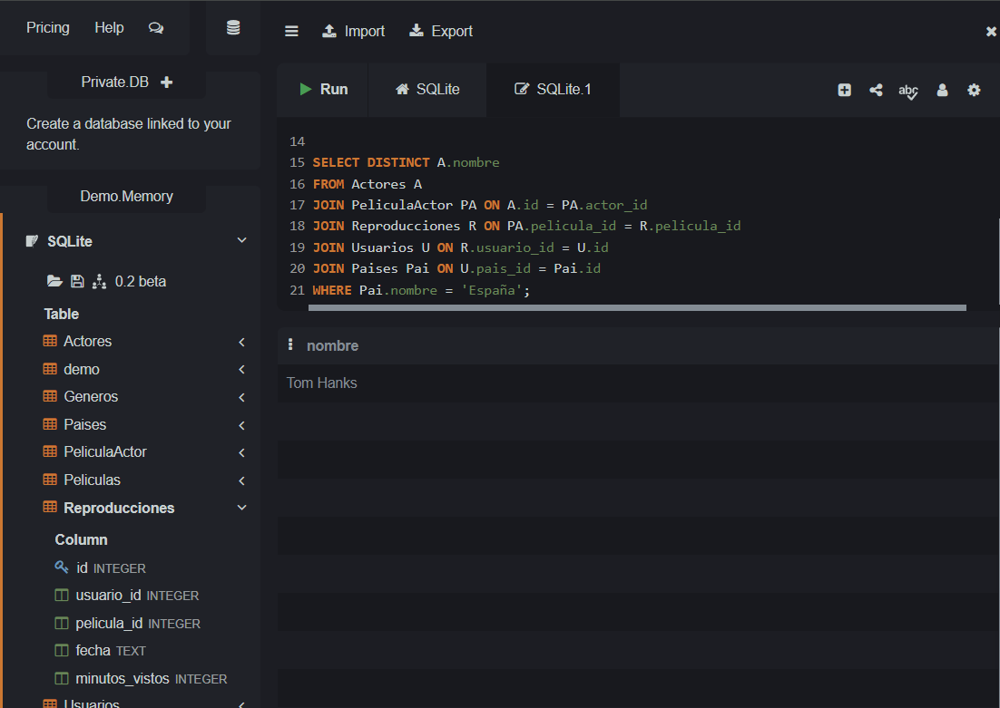